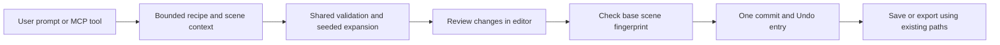

# Procedural world authoring through AI and MCP

Research and source review: September 27, 2026. This design targets the existing Three.js editor. It does not promise native Unity/Unreal conversion, arbitrary AI script execution, or a complete game generated from every prompt.

## Recommended language and approach

**Use JavaScript for the current implementation, with TypeScript types or checked JSDoc for growing interfaces. Let AI issue validated JSON world recipes.** This is the shortest route because the editor, scene schema, transaction history, browser runtime, and backend already use JavaScript modules. The user can describe a world in plain language; learning a programming language is optional for that workflow.

Three.js provides the scene, geometry, materials, cameras, and object transforms needed to construct procedural environments. TypeScript adds static checking to JavaScript; it does not replace validation of model output at runtime. These capabilities support this recommendation, while the judgment about easiest implementation comes from the existing repository. [Three.js fundamentals](https://threejs.org/manual/pages/fundamentals.html), [TypeScript for JavaScript programmers](https://www.typescriptlang.org/docs/handbook/typescript-in-5-minutes.html).

| Approach | Fit for this task |
| --- | --- |
| Existing Three.js + JavaScript/TypeScript | Recommended. Add generators and a shared command schema to the existing editor. |
| Another JavaScript web engine | Viable for a new product, but switching would require translating current editing, rendering, components, saves, and exports. PlayCanvas also uses reusable JavaScript entity scripts; changing engines is unnecessary to enable procedural placement. [PlayCanvas scripting](https://developer.playcanvas.com/user-manual/scripting/getting-started/). |
| Unity C# | Appropriate when targeting a Unity project. Unity documents explicit JavaScript/C# browser interoperability; it would introduce an additional runtime/integration here. [Unity browser scripting](https://docs.unity.com/en-us/engine/6000.7/manual/platform-specific/webgl/develop/interactingwithbrowserscripting). |
| Unreal C++ | Appropriate inside Unreal's compiled gameplay framework. It does not directly operate this Three.js editor. [Unreal C++ programming](https://dev.epicgames.com/documentation/unreal-engine/programming-with-cplusplus-in-unreal-engine). |

## Initial source snapshot and concrete gaps

This snapshot was taken before the procedural implementation began. The implementation update below supersedes the backend gaps it explicitly closes.

- `platform/server/model-connections.mjs`: authenticated, verified users submit one explicitly approved request through their own encrypted provider connection. Fixed provider endpoints, usage limits, request idempotency, and manual review already exist. Current supported proposals are `summary` plus up to 50 primitive add/update/remove operations.
- Provider scene summaries currently contain at most 250 entities and 32 KiB of safe metadata. The editor currently takes the first 250 entities. That truncation must be disclosed; it must not imply the model has inspected the whole world.
- Proposal output currently cannot instantiate known GLB assets, generate repeatable layouts, set scene settings, or author the full supported player/collectible/animation component set. The runtime's richer components do not automatically make them available through the provider interface.
- `engine/core/project-store.mjs` validates a cloned proposed project before a single commit and Undo entry. This is the right commit boundary. The current flow does not bind proposals to a complete base-scene fingerprint, so edits made after the prompt require explicit stale-scene protection.
- `integrations/blender/mcp-server.mjs` exposes a bounded optional **Blender** adapter. It does not currently give external MCP clients access to the live browser editor. It explicitly returns protocol version `2025-06-18`.

The recipe and browser MCP extensions described below are implementation work. Their existence must be established from code and verification before claiming the feature is ready.

## Minimal useful world-building implementation

### One shared recipe validator and deterministic generator

Add a small authoritative module such as `engine/core/procedural.mjs`, usable by the backend, browser editor, and local bridge. It should expose schema/version information, strict validation, and a pure recipe-to-project-change generator. Unknown fields, unsupported object types, URLs, scripts, executable expressions, arbitrary asset downloads, and filesystem paths are rejected.

Start with bounded primitive layouts and placement of **existing project asset IDs**: a ground, a repeating grid/row, seeded scattered objects, a simple obstacle course, lights, a camera, and a supported player controller. These are real authored objects that remain editable. A forest can use a known tree model, or clearly labeled primitive trees when no model was provided. Do not pretend procedural primitive geometry is a newly generated production art asset.

Use explicit integer/string seeds and generator versions. Expansion must give the same geometry/transforms from the same recipe and seed. The current generator uses fresh object IDs per preview, and only that exact preview may be applied once; request idempotency and consumed-preview checks prevent accidental replay. Validate total output against the existing project, including the 5,000-entity and 32-light limits, hierarchy, finite transforms, material bounds, asset ownership/availability, and component invariants. A player requires a dynamic rigid body; spin and rigid body cannot be combined.

The first release uses a separate recipe budget: 64 recipe operations and 500 expanded new entities, while retaining the 50-operation direct-edit limit. Do not equate one recipe with unlimited scene mutations. Estimate object and collision cost before Apply. Large layouts, heightmap terrain, roads, navigation meshes, and full gameplay systems need their own schemas and performance work.

### Request, review, and apply contract

Keep the existing `summary + operations` response compatible. Add an alternative `summary + worldRecipe` result, with exactly one representation per proposal. The recipe is untrusted data until validated. Input metadata should include project identity, a base fingerprint/revision, total entity count, an explicit truncated-summary indicator, and a bounded allowlist of existing asset metadata. Do not send raw assets, secrets, URLs, or scripts by default.

Before Apply, expand into a temporary project, show the object/change counts and unsupported requests, and compare the original full-project fingerprint. Reject stale proposals instead of overwriting later edits. Apply the checked result as one transaction with one Undo entry. Preflight required asset bytes; if validation, expansion, or loading fails, retain the current world and report the error. Recheck the fingerprint at commit after any asynchronous work. Built-in BYOK uses an explicit Apply action; the optional MCP connection may permit an external client to apply exact previews after the user enables writes for that session.

Persist a request/proposal ID and input hash. A repeated ID with matching content returns the same staged/result state; conflicting content is rejected. Keep a clear distinction between proposal received, review pending, changes committed, and project saved. A staged proposal is not a completed edit. Avoid automatic provider retries; preserve explicit user billing consent and existing BYOK limits.

## MCP architecture for the browser editor

MCP connects a client hosted by an AI application to tools provided by a server. A model API credential alone does not create that connection. There are two useful entry points into the same recipe pipeline:

1. **Built-in BYOK:** the current authenticated backend asks the chosen provider for one recipe, and the browser reviews/applies it. No local installation is needed for this path.
2. **External desktop AI client:** a small local MCP server provides bounded tools such as scene-summary read, asset metadata read, recipe staging, and proposal-status read. An explicitly paired editor tab connects to the local helper and receives proposals for review. It never exposes a general JavaScript executor. The MCP server must not receive the user's browser login cookies or their model-provider keys.

Use stdio for a desktop AI client that launches the helper; use a separate authenticated loopback channel between helper and browser. The browser does not launch a stdio subprocess itself. Remote MCP over HTTPS is a later alternative requiring a proper authorization service, project scopes, and ownership checks; it must not be approximated by putting session cookies or secrets in URLs. [MCP transports](https://modelcontextprotocol.io/specification/2026-07-28/basic/transports), [MCP authorization](https://modelcontextprotocol.io/specification/2026-07-28/basic/authorization).

### Version and local connection requirements

The official `/latest` specification currently resolves to **2026-07-28**. That revision removed protocol-level HTTP sessions and the GET stream endpoint and introduced per-request metadata. Older clients can use the earlier lifecycle through documented compatibility behavior. Pin the exact supported version and test the intended client; do not label the current 2025 adapter as latest-compatible without implementing that protocol. Application pairing state remains necessary regardless of MCP's transport session model. [Current Streamable HTTP](https://modelcontextprotocol.io/specification/2026-07-28/basic/transports/streamable-http), [version compatibility](https://modelcontextprotocol.io/specification/2026-07-28/basic/versioning).

For the proposed helper:

- Bind only to loopback. Reject unexpected Host values, invalid/present Origin values, and browser requests without the exact paired origin. Native stdio/helper calls need separately authenticated handling; a missing Origin is not proof of trust. Use exact CORS allowances, never wildcard credentials.
- Require a high-entropy pairing credential with expiry/revocation. Pair to the explicit editor tab, active project, and current account context where applicable. Require a separate unpredictable tab capability for browser command receipt/results. A project ID, MCP request ID, or old protocol session ID is not authentication.
- Clear queued proposals and revoke the pairing when the tab changes project/account, disconnects, or expires. Do not permit a second tab to silently replace the authorized tab. Validate origin, credentials, pairing, and project ownership on every sensitive request.
- Bound body size, rate, queue length, concurrent work, and request lifetime. Return status for retries. Never auto-apply commands merely because a trusted tool name or annotation was supplied. Scene labels and tool output remain untrusted data.
- Use proper HTTPS/OAuth audience-bound tokens if a remote MCP service is later added. Do not pass a provider API token through as MCP authorization or accept a token issued for another service. [MCP authorization](https://modelcontextprotocol.io/specification/2026-07-28/basic/authorization).

Google documents browser permission controls for local network requests. HTTPS-to-loopback behavior, CORS, CSP, and permission denial must be checked in the actual desktop/mobile browser; do not tell users to disable browser security. A phone's localhost points to that phone, so the desktop helper is not automatically available there. The built-in BYOK path remains the practical mobile option. [Chrome Local Network Access](https://developer.chrome.com/blog/local-network-access).

## Reliability, performance, and acceptance

Generated objects should use the existing scene/store/export format. This avoids a second world representation that saves correctly but cannot play or export. Repeated static objects can later use Three.js `InstancedMesh` to reduce draw calls, while preserving logical entity IDs and editor selection. Instancing is an optimization with its own editing/collision/export work, not an excuse to accept unbounded worlds. [Three.js InstancedMesh](https://threejs.org/docs/pages/InstancedMesh.html).

Required verification includes: deterministic seed output; unknown keys/code/URL rejection; asset ID scope; recipe expansion limits; player/physics invariants; same-ID replay; conflicting payloads; stale-scene rejection; one Undo/Redo transaction; failed-generation preservation; save/reopen/web-export fidelity; touch controls; memory and frame-time checks on target phones; loopback Host/Origin rejection; missing/expired/wrong-tab credentials; denied local-network permission; bounded queues; and exact supported MCP lifecycle behavior. Use provider fixtures for tests, with no paid calls.

A successful first milestone is: a connected AI proposes a bounded world using primitives and known assets, the user sees it in review, Apply creates an editable playable scene, Undo restores the previous scene, and save/export preserves it. Arbitrary custom scripting, autonomous build loops, generated external art, unlimited terrain, and native engine project conversion remain separate work.

## Implementation update from this work

The BYOK backend now imports the shared procedural validator and accepts the alternative `summary + worldRecipe` output while preserving `summary + operations`. It projects bounded existing asset metadata, validates explicit total/truncation fields, uses complete declared entity/light totals for recipe capacity checks, echoes an optional base fingerprint, and keeps ownership, billing consent, encrypted keys, usage limits, and request idempotency. Invalid recipes remain inert text. It creates no project or asset records.

`node --test tests/model-connections.test.mjs` passed **47/47** locally after this change, using real SQLite and mocked upstream responses. Cases cover all three providers, unsafe recipes, asset allowlists, projected totals, fingerprint idempotency, the actual editor's large-scene projection, and unchanged credential/cost boundaries. No paid call was made. See [BYOK contract](model-connections.md) for exact fields and limits.

The local editor MCP bridge and editor preview/apply UI are separate coordinated changes; their final browser verification must be reported separately. Setup and the pinned protocol are documented in [local editor MCP](../../integrations/editor/README.md). This backend result alone does not establish a complete external-client-to-browser workflow.
